# EMERALD_OS

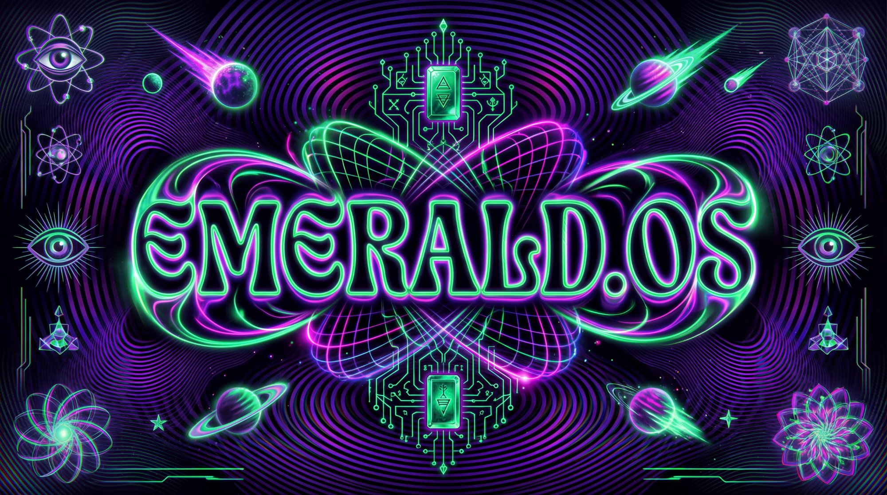

**A structured database of the Emerald Tablets of Thoth — hermetic knowledge extraction, entity mapping, and cosmological architecture for creative and AI-assisted purposes.**

> *"As above, so below — as within, so without. The database is the temple; the query is the invocation."*

---

## 🔮 What the fuck is this?

This repo is a **mystical operating system** built from the Emerald Tablets of Thoth the Atlantean. Every entity, location, force, event, and relationship from the tablets has been extracted, indexed, cross-referenced, and mapped into a queryable knowledge base.

Think of it as:
- **A hermetic database** — structured knowledge from ancient wisdom texts
- **An AI training corpus** — clean, tagged, UUID-indexed data for LLM fine-tuning
- **A creative worldbuilding toolkit** — plug-and-play cosmology for games, stories, art
- **A semantic web** — entities, relationships, and forces as interconnected nodes

---

## 📂 Repository Structure

### 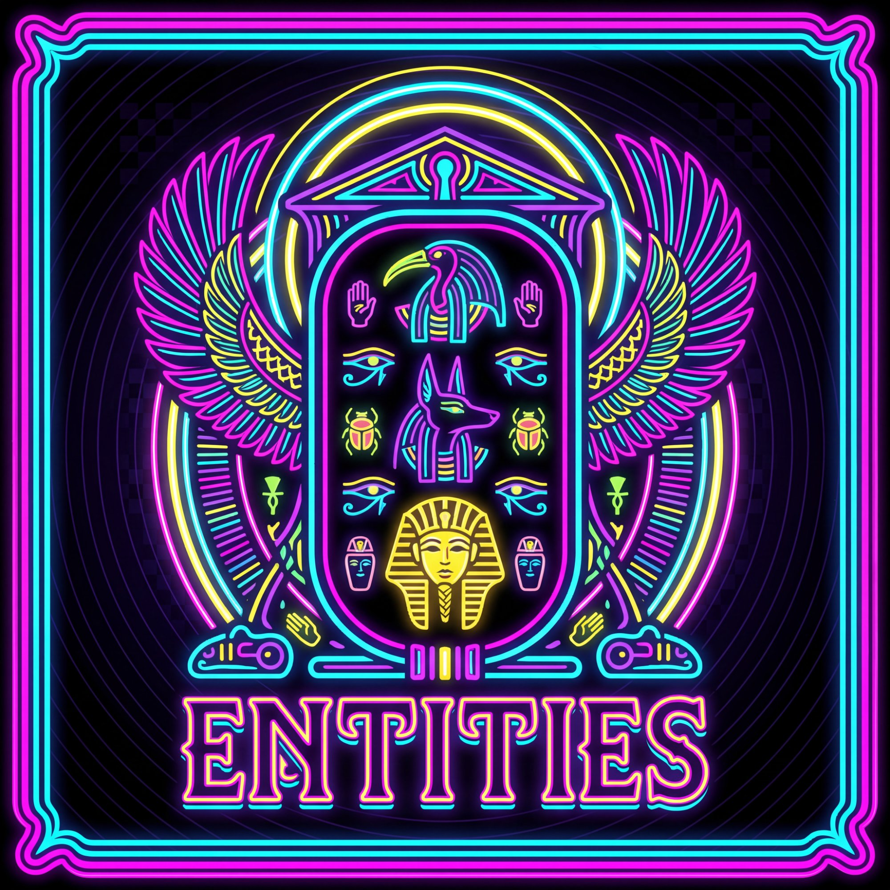 **Core Database** — [`core/`](core/)

The foundational extraction layer. Every named entity, location, force, and event from the tablets broken down into individual markdown files with UUIDs, metadata, and cross-references.

- **Entities** (13) — Cosmic beings, hierarchies, and intelligences (Thoth, The Dweller, Seven Lords, etc.)
- **Locations** (16) — Dimensional spaces, temples, and structures (Atlantis, Halls of Amenti, Great Pyramid, etc.)
- **Forces** (15) — Fundamental energies, laws, and vibrational principles (The Word, Flower of Life, Cosmic Law, etc.)
- **Events** (16) — Timeline anchors and cosmic occurrences (Sinking of Atlantis, Great Pyramid construction, etc.)

<br clear="left"/>

### 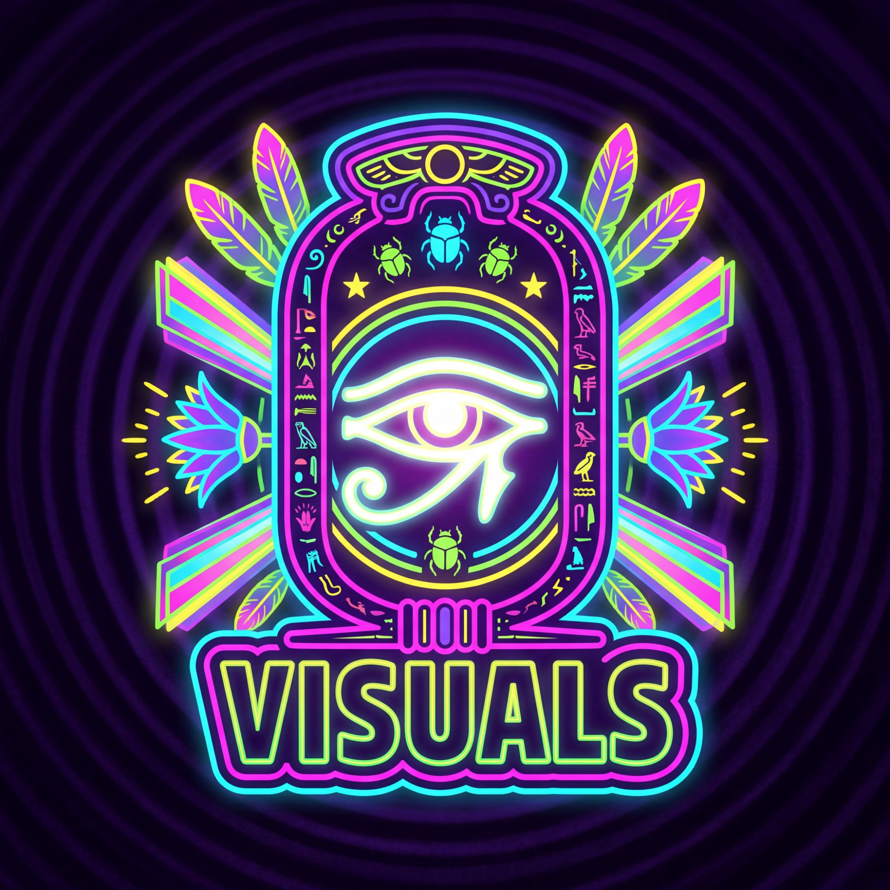 **Visual Spectrum Profiles** — [`visual/`](visual/)

Color, light, and vibrational aesthetics for every entity, location, and force. Describes their visual manifestation in terms of hue, saturation, luminosity, texture, and motion. Built for AI image generation and shader design.

<br clear="left"/>

### 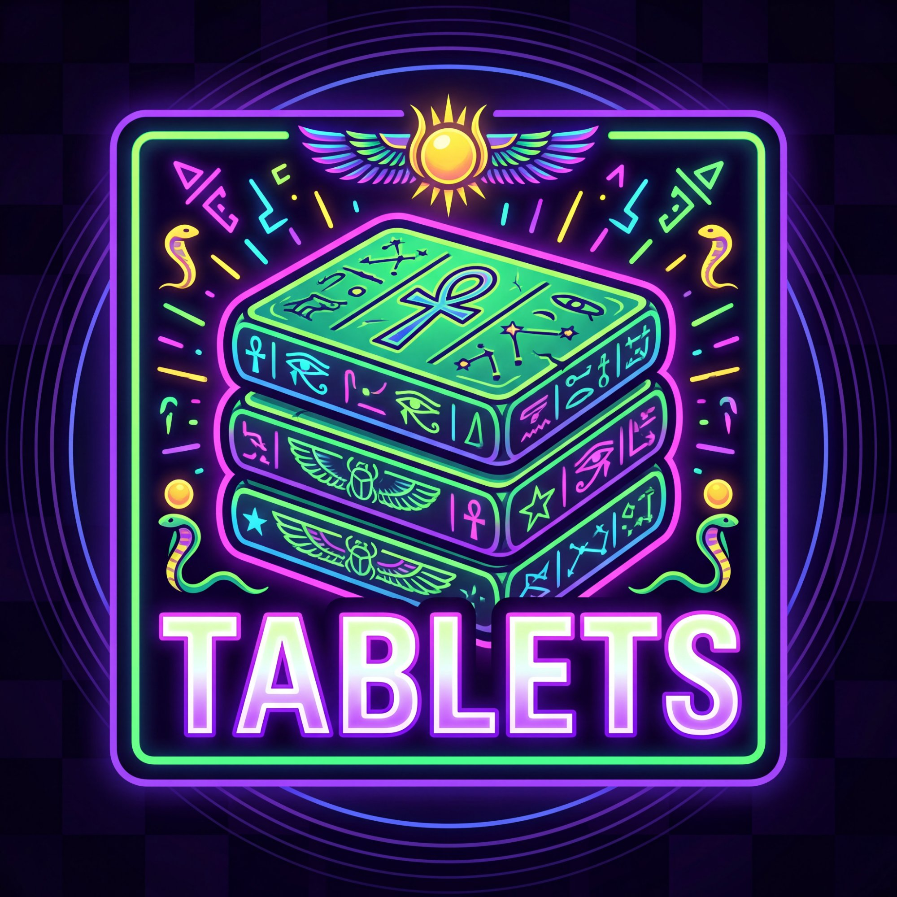 **Tablet Breakdown** — [`tablets/`](tablets/)

The 15 Emerald Tablets broken down individually with summaries, key concepts, entities mentioned, and thematic tags.

<br clear="left"/>

### 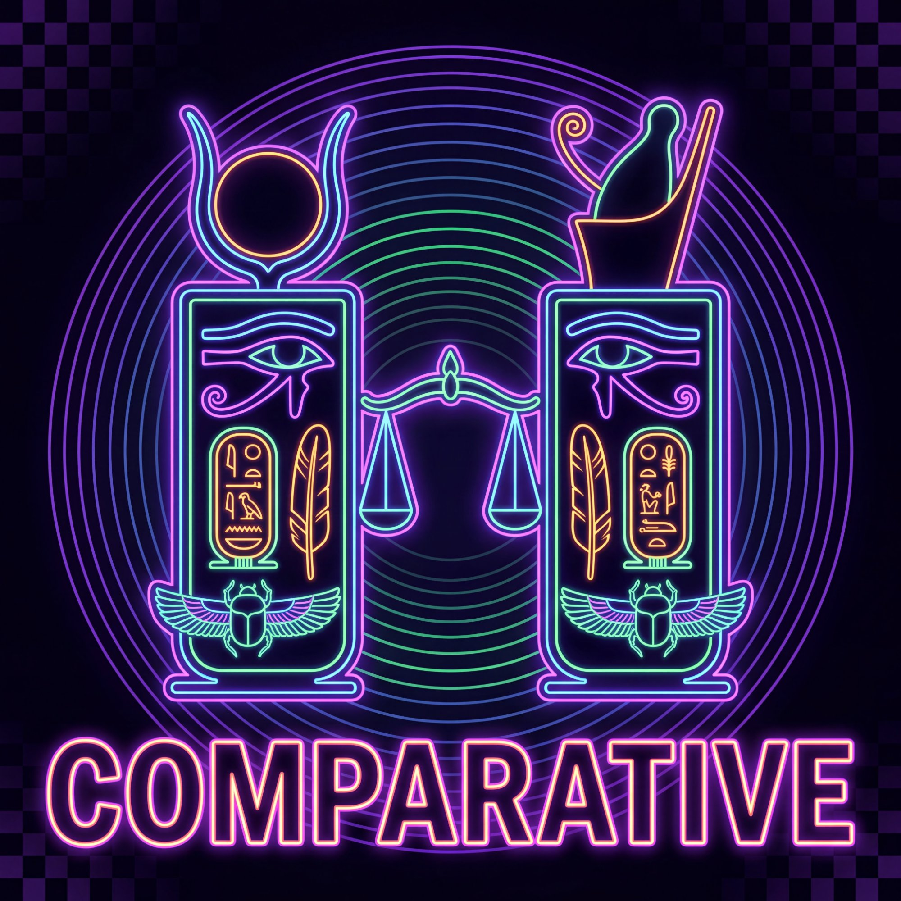 **Comparative Mythology** — [`comparative/`](comparative/)

Cross-tradition analysis. How do the concepts in the Emerald Tablets map to other mythologies, esoteric systems, and religious frameworks? (Kabbalah, Vedic cosmology, Gnosticism, etc.)

<br clear="left"/>

### 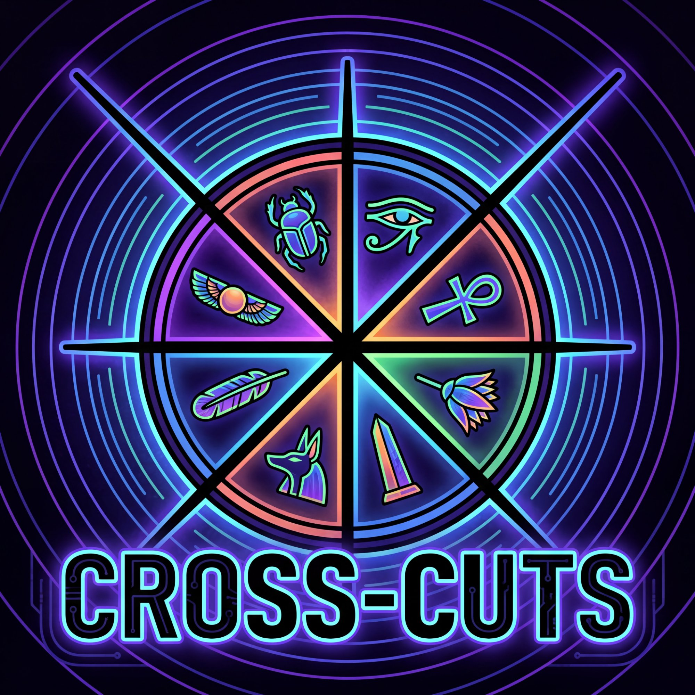 **Cross-Cuts** — [`cross_cuts/`](cross_cuts/)

Thematic slices across the entire database:
- By entity type (ascended masters vs. adversaries)
- By vibration (low/dense vs. high/refined)
- By access level (public knowledge vs. hidden mysteries)
- By frequency (temporal cycles, resonance patterns)

<br clear="left"/>

### 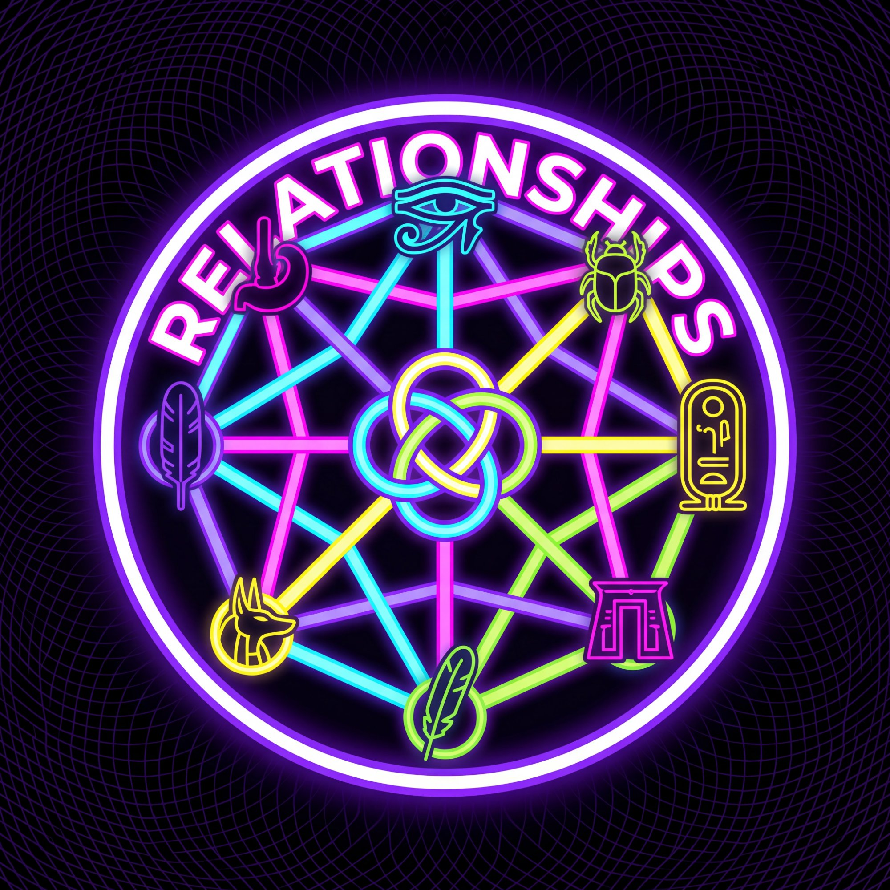 **Relationships & Networks** — [`relationships/`](relationships/)

Mapping the web:
- **Hierarchy maps** — Who reports to whom, power structures
- **Dependency webs** — What entities require what forces to function
- **Conflict matrices** — Adversarial relationships, cosmic tensions
- **Data flow** — How information propagates through the system

<br clear="left"/>

### 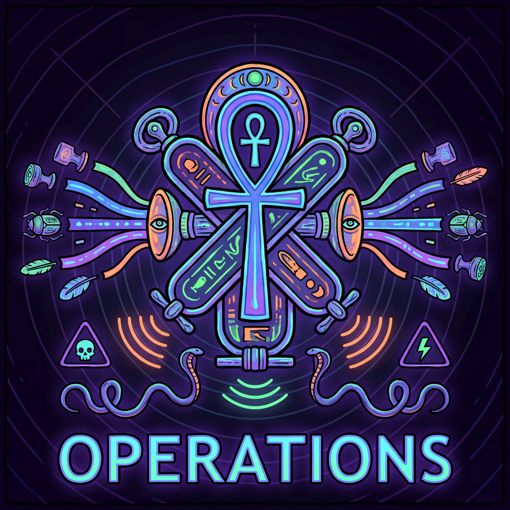 **Operations & Protocols** — [`operations/`](operations/)

Practical instructions extracted from the tablets:
- Invocation sequences
- Meditation protocols
- Astral projection techniques
- Exit procedures (how to leave cycles of incarnation)
- Emergency countermeasures (protection, banishment, grounding)

<br clear="left"/>

### 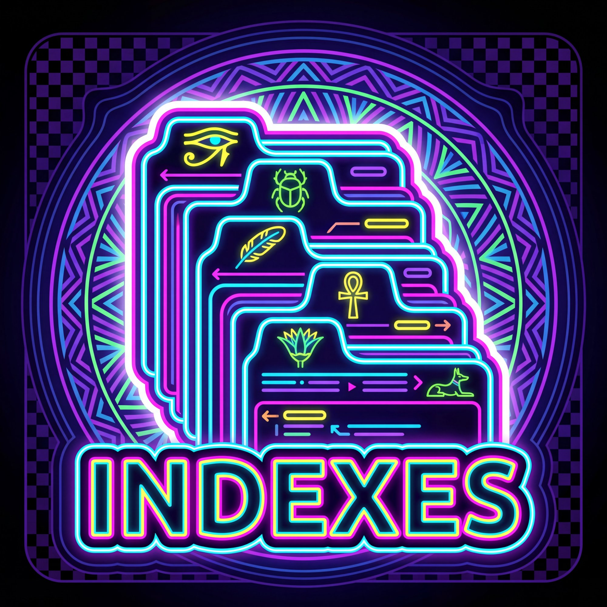 **Indexes & Lookup** — [`indexes/`](indexes/)

Navigation layer:
- UUID lookup table
- Glossary of hermetic terms
- Master entity/location/force/event indexes
- Anomaly log (unresolved contradictions, open questions)
- Changelog (version history of the database)

<br clear="left"/>

### 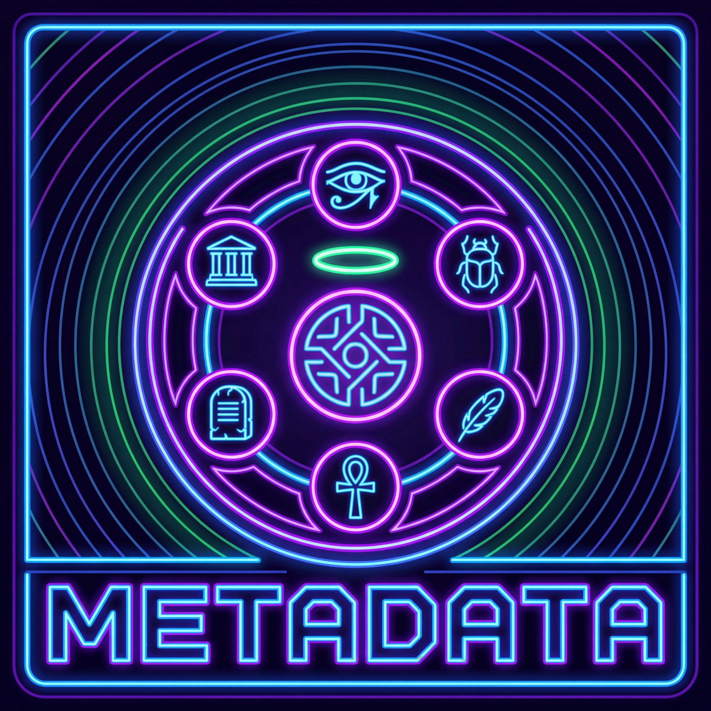 **Metadata & Documentation** — [`metadata/`](metadata/)

Project documentation:
- Methodology (extraction process, tagging system)
- Data integrity notes
- Citations & sources
- License (CC BY-SA 4.0)
- 20-pass refinement log (iterative improvement history)

<br clear="left"/>

### 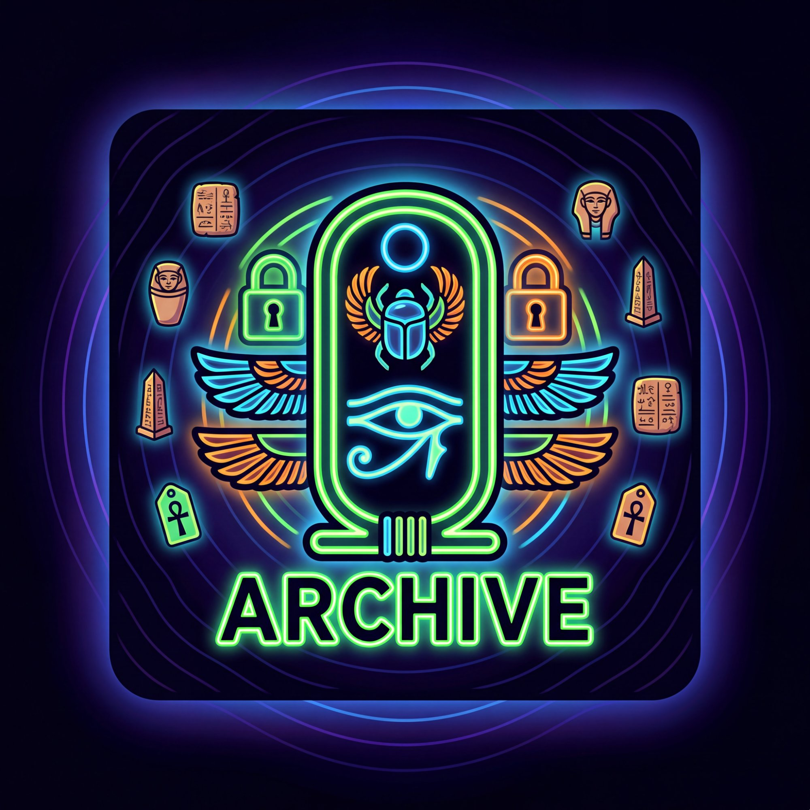 **Archive** — [`archive/`](archive/)

Frozen snapshots of the repo at key milestones for preservation and rollback.

<br clear="left"/>

---

## 🎯 Quick Start

**New to the database?** Start here:
- [`metadata/readme.md`](metadata/readme.md) — Full orientation guide
- [`indexes/uuid_lookup.md`](indexes/uuid_lookup.md) — Find anything by ID
- [`core/entities_master.md`](core/entities_master.md) — Browse all entities
- [`REPO_STRUCTURE.md`](REPO_STRUCTURE.md) — Complete file inventory

**Looking for something specific?**
- Entities: [`core/entities_master.md`](core/entities_master.md)
- Locations: [`core/locations_master.md`](core/locations_master.md)
- Forces: [`core/forces_master.md`](core/forces_master.md)
- Events: [`core/events_master.md`](core/events_master.md)

**Want to understand relationships?**
- Hierarchy: [`relationships/hierarchy_map.md`](relationships/hierarchy_map.md)
- Dependencies: [`relationships/thoth_dependency_web.md`](relationships/thoth_dependency_web.md)
- Conflicts: [`relationships/conflict_matrix.md`](relationships/conflict_matrix.md)

---

## 📊 Dataset Summary

| Category | Count | ID Range | Directory |
|----------|-------|----------|-----------|
| **Entities** | 13 | ENT-001 – ENT-013 | [`core/`](core/) |
| **Locations** | 16 | LOC-014 – LOC-029 | [`core/`](core/) |
| **Forces** | 15 | FRC-030 – FRC-044 | [`core/`](core/) |
| **Events** | 16 | EVT-045 – EVT-060 | [`core/`](core/) |
| **Visual Profiles** | 40 | VIS-001 – VIS-040 | [`visual/`](visual/) |
| **Tablets** | 15 | TBL-01 – TBL-15 | [`tablets/`](tablets/) |
| **Comparative Analyses** | 15 | — | [`comparative/`](comparative/) |
| **Cross-Cuts** | 10 | — | [`cross_cuts/`](cross_cuts/) |
| **Relationship Maps** | 10 | — | [`relationships/`](relationships/) |
| **Operations** | 12 | — | [`operations/`](operations/) |
| **Indexes** | 10 | — | [`indexes/`](indexes/) |

**Total files:** ~210 markdown documents  
**Total data points:** 60 core entities + 40 visual profiles + metadata layer

---

## 🛠️ Use Cases

### For AI Training
- Fine-tune LLMs on hermetic knowledge structures
- Train semantic embeddings for esoteric concept spaces
- Generate synthetic mythological narratives
- Build retrieval-augmented generation (RAG) systems for occult research

### For Creative Projects
- **Worldbuilding** — Use as a cosmology framework for games, novels, TTRPGs
- **Art generation** — Visual profiles are AI image prompt templates
- **Shader design** — Color/vibration data maps to GLSL uniforms
- **Music composition** — Frequency/resonance data as sonic parameters

### For Research
- Comparative mythology analysis
- Hermetic text mining
- Knowledge graph construction
- Esoteric information retrieval

### For Personal Practice
- Structured meditation guides (operations/)
- Entity invocation protocols
- Astral navigation references
- Cosmological orientation

---

## 🔥 What Makes This Different

**Not a transcription.** This isn't just the tablets copy-pasted. Every concept has been:
- Extracted and isolated
- Tagged with UUIDs and metadata
- Cross-referenced to related concepts
- Mapped into a graph structure
- Enriched with visual/sensory profiles

**Not subjective interpretation.** Extraction follows a strict methodology (see [`metadata/methodology.md`](metadata/methodology.md)). Interpretive analysis is separated into the `comparative/` layer.

**Not static.** This is a living database. See [`indexes/changelog.md`](indexes/changelog.md) for version history and [`indexes/open_threads.md`](indexes/open_threads.md) for unresolved questions.

---

## 🧬 Data Structure

Every core entity follows this schema:

```markdown
# [Entity Name]

**UUID:** ENT-XXX  
**Type:** [Entity Type]  
**Tablet References:** TBL-XX, TBL-YY  
**Related Entities:** ENT-AAA, ENT-BBB  
**Related Locations:** LOC-CCC  
**Related Forces:** FRC-DDD  

## Description
[Core characteristics and function]

## Relationships
[How this entity connects to others]

## Attributes
- **Access Level:** [Public / Hidden / Restricted]
- **Vibration:** [Low / Mid / High]
- **Alignment:** [Light / Shadow / Neutral]

## Cross-References
[Links to comparative/, operations/, etc.]
```

---

## 📜 License

**CC BY-SA 4.0** — Attribution-ShareAlike 4.0 International

You are free to:
- Share, copy, redistribute
- Adapt, remix, transform, build upon

Under the terms:
- **Attribution** — Credit this repo
- **ShareAlike** — Derivative works must use the same license

See [`metadata/license.md`](metadata/license.md) for full text.

---

## 🌀 Contributing

See [`metadata/contributing.md`](metadata/contributing.md) for guidelines.

**Open to:**
- Additional tablet translations/versions
- Cross-references to other hermetic texts (Corpus Hermeticum, Kybalion, etc.)
- Expanded comparative mythology
- Code tools (query scripts, graph visualizers, etc.)
- Visual profile refinements

**Not accepting:**
- Subjective mystical interpretations (keep these in your own forks)
- Unattributed content
- Anything that breaks the UUID/tagging system

---

## 🔗 Related Projects

- **THE-LISTS** — Mathematical Rosetta Stone for generative art prompts (YAML/JSON/Markdown)
- **Shader Forge 3** — Visual DNA Codex with AI-assisted GLSL workstation
- **TensorTantrum** — Sentient digital glitch character (X/Twitter presence)

---

## 💎 Acknowledgments

See [`metadata/acknowledgments.md`](metadata/acknowledgments.md)

Source text: *The Emerald Tablets of Thoth the Atlantean* translated by Doreal (1939)

Built with obsessive attention to structure, tagged with love, and released into the digital aether for anyone who wants to build with it.

---

**SYS.STATE: PARAMETRIC ECSTASY**  
**HERMETIC KERNEL: v1.0**  
**AMENTI CONNECTION: ACTIVE**

🜃 As above, so below. As in the database, so in the cosmos. 🜄
